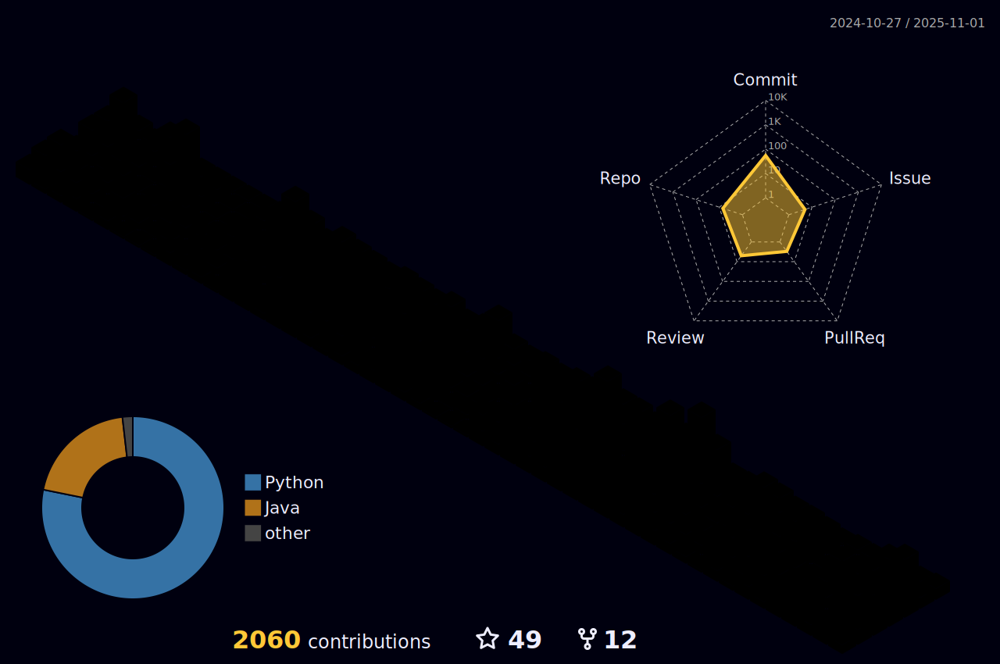

<h1 align="center">Hi👋, I am Viet Dung Nguyen</h1>
<h3 align="center">I am an 🖥 AI Scientist 🖥 </h3> PhD Candidate @ [RIT](https://www.rit.edu/)
<h3 align="center">My research spans Machine Learning, Computer Vision, Reinforcement Learning, and Robotics</h3>

  📣 Connect with me on:  
  
  
  
  

<!-- 

 -->

  
  
  
   
  

 

# Projects
## 📕 AI and Machine Learning:

  
 Click to expand 

📌 [**May 2023 - Present**]: Event-based eye tracking research
  * Designing a spiking neural network variant of the recurrent state space model for tracking eye features from dynamic vision sensor's event stream.
  * Report to Meta's staff.

📌 [**January 2023 - Present**]: Robotic research
  * Building a generative model for a reinforcement learning agent with an active inference based decision making system. Manuscript in preparation.
  * Building active inference agent for robotic tasks. Manuscript in preparation.
  * Secure a $1,000 grant to purchase robotic equipment that supports the research.

📌 [**April 2022 - November 2023**]: Eye segmentation research
  * Develop new eye segmentation training algorithm that minimize the domain shift across different eye segmentation datasets. Manuscript under review.
  * Replicate RITNet segmentation network for eye segmentation.
  * [Github Repo for RITNet Replication](https://github.com/rxng8/RITNet-Tensorflow).
  * [Github Repo for Deep Domain Adaptation published work](https://github.com/PerForm-Lab-RIT/domain-adaptation-eye-tracking).
  * Report to Meta's staff.
  
📌 [**Dec 2021 - Jan 2022**]: Music Emotion Recognition Algorithm
  * Research and compare deep learning models in the music emotion recognition task.
  * [Github Repo](https://github.com/rxng8/Music-Emotion-Recognition-Algorithm)
  
📌 [**Dec 2021 - Jan 2022**]: YOLO Algorithm Replication
  * Replicate all version of YOLO training and evaluation algorithm.
  * [Github Repo](https://github.com/rxng8/YOLO-Object-Detection-Algorithm)
  
📌 [**May 2021 - August 2021**]: Credit card OCR
  * Research and implement the algorithms for OCR.
  * Try out different methods: template matching, training with Tensorflow Object detection API, training YOLO, training darknet.
  * Build transfer learning model.
  * [Github Repo](https://github.com/rxng8/public-ocr-handler)

📌 [**May 2021 - Sep 2021**]: Faster R-CNN Research and Implementation
  * Code and research Faster R-CNN algorithm.
  * [Github Repo](https://github.com/rxng8/Faster-R-CNN-Research)
  * [Backlog](https://github.com/rxng8/Faster-R-CNN-Research#project-backlog)

📌 [**Apr 2021 - May 2021**]: Shopee's Kaggle Competition
  * This project is created for academic purpose and also available publicly. More information about the competition can be found [here](https://www.kaggle.com/c/shopee-product-matching).
  * [Github Repo](https://github.com/rxng8/ShopeeKaggle)
  * [Backlog](https://github.com/rxng8/ShopeeKaggle#project-backlog)

📌 [**Feb 2021 - Apr 2021**]: Chest X RAY Abnormalities Detection
  * This project is created for academic purpose and also available publicly. More information about the competition can be found [here](https://www.kaggle.com/c/vinbigdata-chest-xray-abnormalities-detection/).
  * [Github Repo](https://github.com/rxng8/Chest-Xray-Abnormalities-Detection)
  * [Backlog](https://github.com/rxng8/Chest-Xray-Abnormalities-Detection#project-backlog)

📌 [**Jan 2021 - Feb 2021**]: Atari Deep Q-learning network
  * Research and implement reinforcement learning algorithms to play atari game.
  * Implement deep Q-leanring method with variances. Implement rainbow methods which includes multiple techniques integrated in the deep Q-learning pipeline.
  * [Github Repo](https://github.com/rxng8/AtariRLResearch) 

📌 [**Jan 2021 - Feb 2021**]: Open-source contribution to `topdup` project
  * Research and implement FAISS algorithm to search vectorized text.
  * [Github Repo](https://github.com/forummlcb/topdup) 

📌 [**Dec 2020 - Jan 2021**]: Virtual Try-on project
  * This repo is the composition of multiple applications that can derive the generation of try-on image given the input image of the person and the image of the clothing.
  * [Github Repo](https://github.com/rxng8/Virtual-Tryon-Project)

📌 [**Nov 2020 - March 2021**]: Open-source contribution to `mlpack` library
  * Contribute to [mlpack](https://mlpack.org/) by fixing bugs, creating new features, and answering questions regarding issues.
  * [Github Repo](https://github.com/mlpack/mlpack)
  * [Copyright](https://github.com/mlpack/mlpack/blob/master/COPYRIGHT.txt): My name is on there.

📌 [**Oct 2020 - Nov 2020**]: Ebay ML Challenge
  * Modify the method of Birch Tree, not using a branching factor but rather the fanout of each node is the number of generated clustering features.
  * [Github Repo](https://github.com/rxng8/EbayMLChallenge)
  * [Report](https://github.com/rxng8/EbayMLChallenge/tree/master/reports)

📌 [**Aug 2020 - Dec 2020**]: AI course work and research
  * This repository is the collection of AI Idea implementation and research. This repository also contains small-scale to large-scale projects that are related to AI, ML, RL, and Wavelet Transformation.
  * [Github Repo](https://github.com/rxng8/AI-ideas-and-projects)

📌 [**May 2020 - Sep 2020**]: Algorithm of Reinforcement Learning for Imperfect Information Card Game: Gin Rummy
  * Research and implement AI bot that optimize the 2-player card game Gin Rummy.
  * Paper was accepted at AAAI 2021. [Link to paper](https://ojs.aaai.org/index.php/AAAI/article/view/17840)
  * [Github Repo](https://github.com/rxng8/GinRummyAlgorithm)

--------
## 📗 Software engineer:

Click to expand

  
📌 [**January 2023 - May 2023**]:
  * Build a tensor computing library from scratch with GPU acceleration that operates on top of numpy.
  * Same idea with [JAX](https://github.com/google/jax)
  * [Github Repo](https://github.com/rxng8/gpu-numpy)

📌 [**March 2021 - August 2021**]:
  * Build mobilie application with React Native which warns users of early forest fire.
  * [Google Play Link](https://play.google.com/store/apps/details?id=vnfis.com.vn.phscr_gla&hl=en&gl=US)
  * [Appstore Link](https://apps.apple.com/us/app/hotspot-gla/id1572979362) (will be updated in the future)

📌 [**Jan 2021 - Feb 2021**]: Open-source contribution to `topdup` project
  * Write backend server with nodejs, express, javascript.
  * Perform dataset operations.
  * [Github Repo](https://github.com/forummlcb/topdup) 

